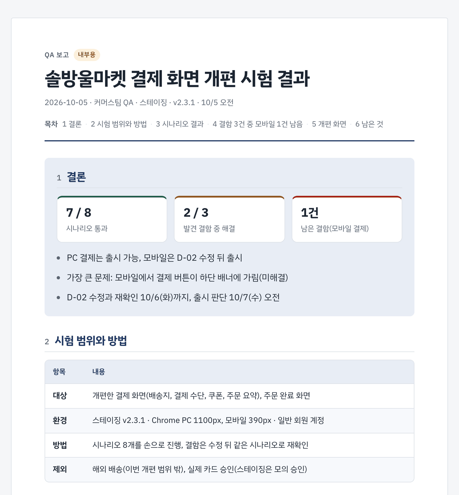
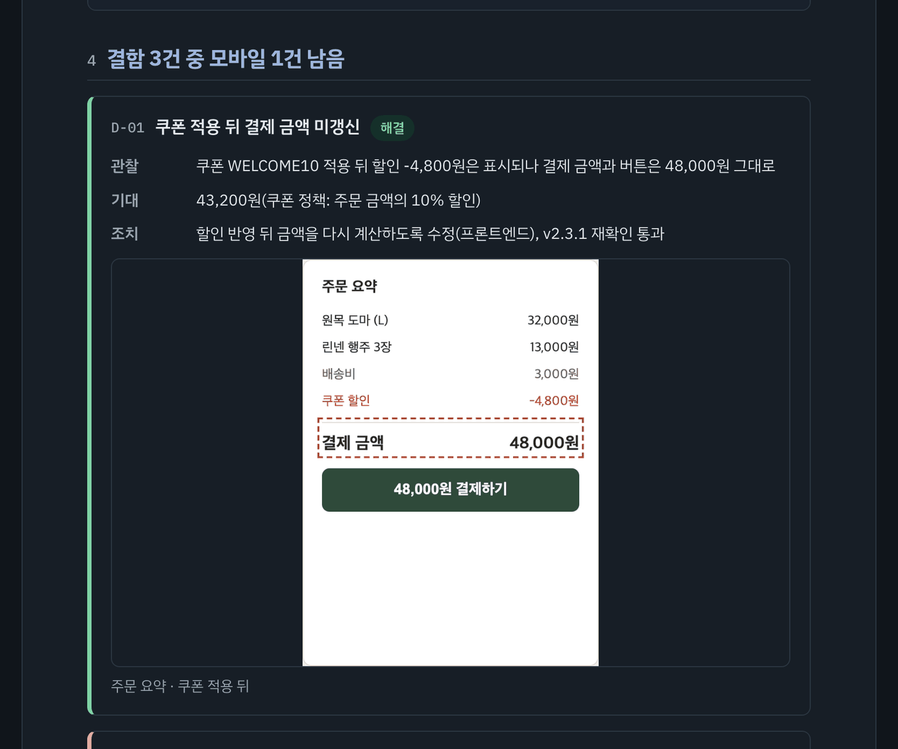
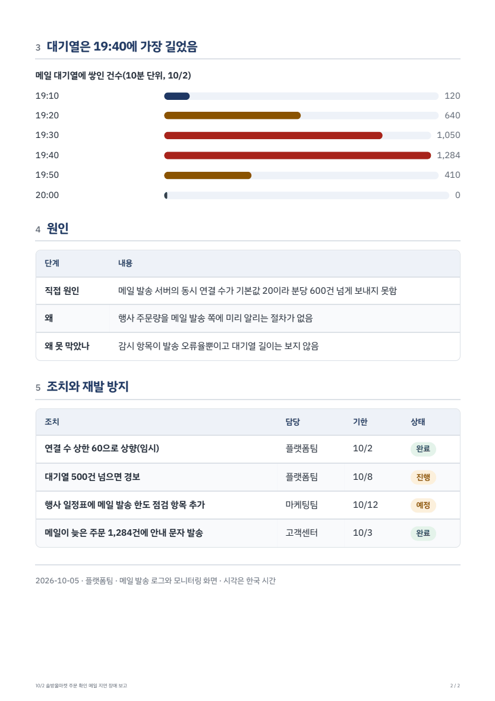

# ko-report

한국어 업무 보고서를 **짧고, 늘 같은 모양의** HTML 한 파일(과 A4 PDF)로 만드는 Claude Code 플러그인.
"QA 보고서 만들어줘"라고 하면 원고를 쓰고, 검사를 통과시키고, 빌드까지 한다.



| 결함 카드 (어두운 화면) | PDF 한 쪽 (A4, 쪽 번호 포함) |
|---|---|
|  |  |

위 화면은 가상의 쇼핑몰 "솔방울마켓"으로 만든 예시다. 원고와 결과물은 [`examples/`](examples/)에 있다.

## 무엇을 하나

| 종류 | 이럴 때 | 첫 절에 오는 것 |
|---|---|---|
| progress (진행) | 주간·월간 진행 보고 | 진척률, 완료 건수, 위험 |
| completion (완료) | 일을 끝내고 결과 보고 | 전후 지표, 남은 것 |
| qa (시험) | 시험 결과, 결함 보고 | 통과 시나리오, 남은 결함 |
| proposal (제안·결정 요청) | 상대가 골라야 할 것이 있을 때 | 제안 하나와 기한 |
| analysis (분석) | 데이터를 보고 판단 | 핵심 수치와 해석 |
| incident (장애) | 장애 경과와 재발 방지 | 영향 시간·범위, 현재 상태 |

- **결론 먼저.** 어느 종류든 첫 절은 숫자 타일 2~4개와 3줄 요약이다.
- **검사 게이트.** `check.py` 가 분량, 결론 우선, AI 티 표현, 평서형 말투를 세고, 대외용이면 경로·커밋·IP·화살표까지 막는다. `READY` 가 나와야 끝난다.
- **디자인 고정.** 스타일은 `report.css` 하나뿐이고 원고에서 바꿀 수 없다. 밝은·어두운 화면을 모두 지원한다.
- **파일 하나.** 이미지까지 HTML 안에 들어간다. 같은 HTML 을 A4 PDF 로도 낸다.
- **QA 증거.** `capture.py` 가 필요한 영역만 2배 해상도로 찍고, 결함은 관찰·기대·증거·조치 카드로 남는다.

## 설치

Claude Code 에서:

```
/plugin marketplace add lehdqlsl/ko-report
/plugin install ko-report@ko-report
```

플러그인 없이 쓰려면 스킬 폴더를 링크한다.

```bash
git clone https://github.com/lehdqlsl/ko-report.git
ln -s "$PWD/ko-report/plugins/ko-report/skills/report" ~/.claude/skills/report
```

필요한 것: Python 3.10+, [uv](https://docs.astral.sh/uv/). PDF·캡처를 쓰면 처음 한 번 `uv run --with playwright python -m playwright install chromium`.

## 쓰는 법

평소처럼 요청하면 된다.

```
어제 결제 화면 개편 시험한 결과로 QA 보고서 만들어줘.
결함은 쿠폰 금액 미갱신(해결), 모바일 결제 버튼 가림(미해결), 우편번호 6자리 허용(해결).
캡처는 shots/ 에 있어. 내부용이고 PDF 도 같이.
```

스킬은 이렇게 진행한다.

1. 종류·독자·결론·기준·형식을 한 줄로 알리고 바로 진행 ("QA 보고 · 내부용 · 결론은 '결함 3건 중 1건 남음' · 기준 스테이징 v2.3.1")
2. 종류별 틀을 복사해 원고(md)를 쓴다. 모르는 값은 지어내지 않고 `[확인 필요: 무엇]` 으로 남긴다
3. `check.py` 가 `READY` 가 될 때까지 원고를 고친다
4. HTML 로 빌드하고, 필요하면 PDF 로 낸다
5. 1280px·390px 화면과 PDF 쪽 이미지를 직접 보고, 결과 파일·검사 판정·빈칸·화면 확인 결과를 보고한다

## 원고 모양

원고는 마크다운에 블록 몇 개를 더한 것이다. HTML·style 은 쓰지 않는다.

```markdown
---
title: 솔방울마켓 결제 화면 개편 시험 결과
type: qa
audience: internal
date: 2026-10-05
basis: 스테이징 · v2.3.1 · 10/5 오전
---

## 결론

:::tiles
7 / 8 | 시나리오 통과 | ok
1건 | 남은 결함(모바일 결제) | bad
:::

- PC 결제는 출시 가능, 모바일은 D-02 수정 뒤 출시

## 결함

:::defect D-02 | 모바일에서 결제 버튼이 하단 배너에 가림 | 미해결
관찰: 390px 화면에서 하단 고정 쿠폰 배너가 결제 버튼을 덮어 누를 수 없음
기대: 결제 버튼은 어느 화면 폭에서도 보이고 눌려야 함
증거: 
:::
```

블록은 숫자 타일(`tiles`), 강조 상자(`callout`), 캡처 묶음(`shots`), 결함 카드(`defect`), 막대 그래프(`bars`) 다섯 가지다. 표 칸에 "통과", "실패", "진행" 같은 상태 단어를 쓰면 색 딱지가 된다. 전체 문법은 [`references/components.md`](plugins/ko-report/skills/report/references/components.md).

## 직접 돌리기

```bash
S=plugins/ko-report/skills/report/scripts
python3 $S/check.py 원고.md
uv run --with markdown --with pillow python $S/build.py 원고.md -o 원고.html
uv run --with playwright --with pypdf --with pypdfium2 python $S/pdf.py 원고.html --pngs
uv run --with playwright python $S/capture.py shots.txt -o shots/      # QA 캡처
```

`check.py` 결과는 `ERROR`(반드시 고침), `WARN`(읽고 판단), `GAP`(빈칸, 사용자에게 알림) 세 가지다.

## 글쓰기 규칙 (요약)

| 규칙 | 내용 |
|---|---|
| 결론 먼저 | 첫 절은 타일 2~4개 + 3줄. "판단, 가장 큰 문제, 다음 할 일" 순서 |
| 절 하나에 메시지 하나 | 절 제목만 이어 읽어도 줄거리가 나오게. 같은 모양 항목 3개 이상은 표로 |
| 말투 두 가지 | 목록·표는 개조식 명사형("수정 완료"), 이어지는 문장은 합쇼체("~습니다"). "~했다"는 쓰지 않음 |
| 분량 | 결론 450자·5항목, 절 700자 권장(1,200자 넘으면 오류), 문서 6,000자, 문장 110자 |
| 수치에 기준 | 어느 서버·판, 언제, 무엇 대비 |
| 쓰지 않는 표현 | "~를 통해", "다양한", "중요합니다", "최적화·고도화", 긴 대시, 이모지 |

자세한 규칙은 [`references/writing.md`](plugins/ko-report/skills/report/references/writing.md). 산문 문단이 길 때는 [im-not-ai](https://github.com/epoko77-ai/im-not-ai) 의 `/humanize` 를 그 문단에만 쓴다.

## 예시

| 예시 | 원고 | 결과 |
|---|---|---|
| QA: 결제 화면 개편 시험 | [md](examples/qa/checkout_qa_261005.md) | [HTML](examples/qa/checkout_qa_261005.html) · [PDF](examples/qa/checkout_qa_261005.pdf) |
| 장애: 주문 확인 메일 지연 | [md](examples/incident/mail_delay_incident_261005.md) | [HTML](examples/incident/mail_delay_incident_261005.html) · [PDF](examples/incident/mail_delay_incident_261005.pdf) |

HTML 은 내려받아 브라우저로 열면 된다. QA 예시의 캡처는 `examples/qa/mock/` 의 가상 화면을 `capture.py` 로 찍은 것이다(`examples/qa/shots.txt`).

## 참고한 것

- [tw93/Kami](https://github.com/tw93/Kami): 템플릿 복사·CSS 무접촉, 빈 자료 표시, AI 문서 실패 패턴
- [anthropics/knowledge-work-plugins](https://github.com/anthropics/knowledge-work-plugins): 진행·장애·결정 요청 보고서 구성
- [garrytan/gstack](https://github.com/garrytan/gstack) qa-only: 결함 증거 규율
- [nicobailon/visual-explainer](https://github.com/nicobailon/visual-explainer): 결론 우선·간결성 규칙
- [epoko77-ai/im-not-ai](https://github.com/epoko77-ai/im-not-ai): 한국어 AI 티 패턴

## 라이선스

MIT
