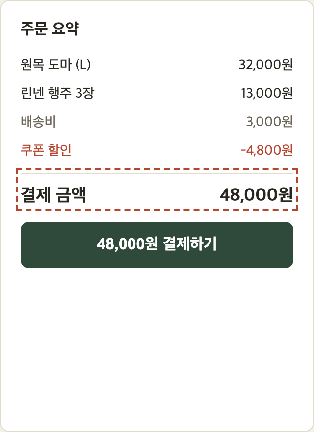
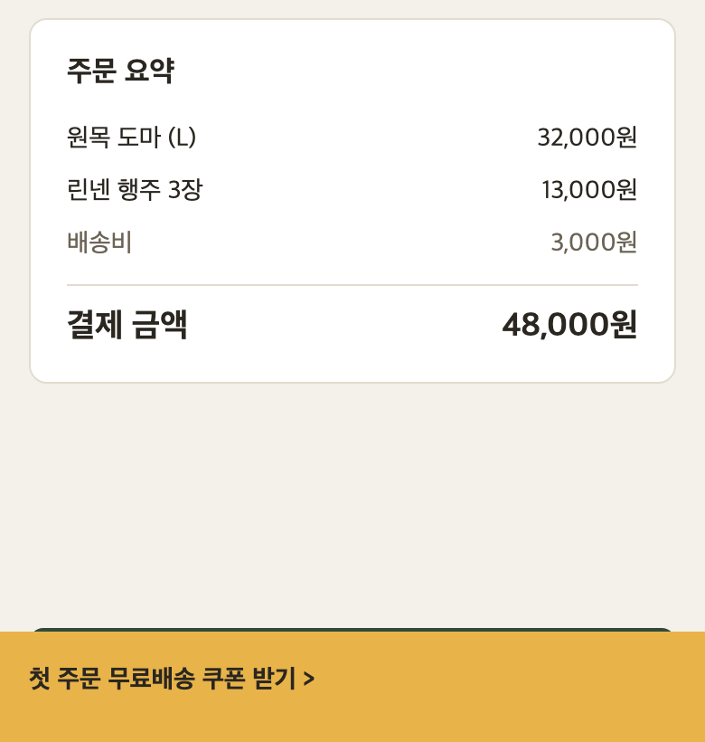
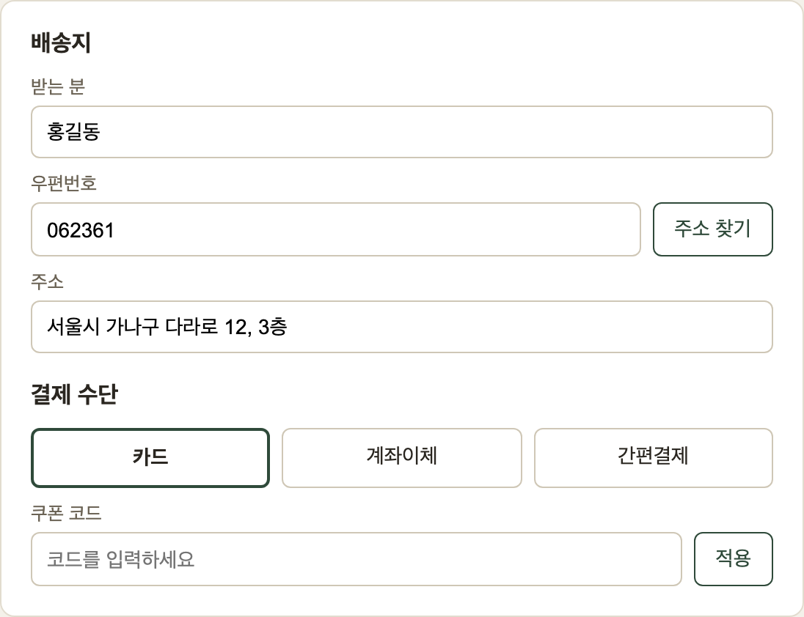
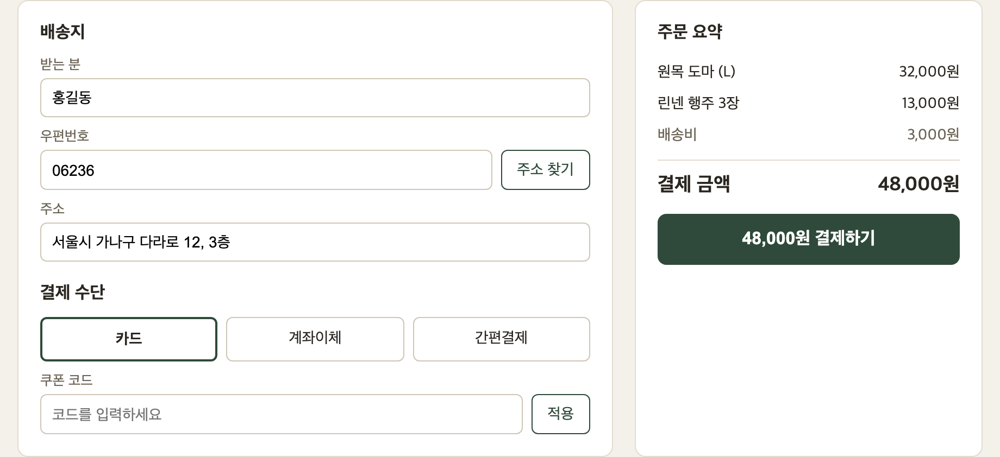
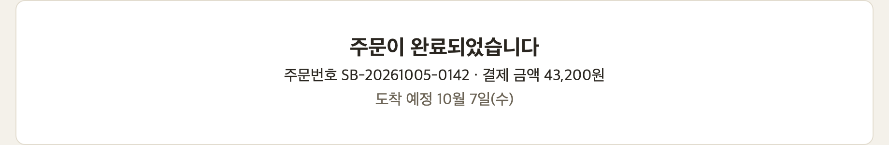

## 결론

:::tiles
7 / 8 | 시나리오 통과 | ok
2 / 3 | 발견 결함 중 해결 | warn
1건 | 남은 결함(모바일 결제) | bad
:::

- PC 결제는 출시 가능, 모바일은 D-02 수정 뒤 출시
- 가장 큰 문제: 모바일에서 결제 버튼이 하단 배너에 가림(미해결)
- D-02 수정과 재확인 10/6(화)까지, 출시 판단 10/7(수) 오전

## 시험 범위와 방법

| 항목 | 내용 |
|---|---|
| 대상 | 개편한 결제 화면(배송지, 결제 수단, 쿠폰, 주문 요약), 주문 완료 화면 |
| 환경 | 스테이징 v2.3.1 · Chrome PC 1100px, 모바일 390px · 일반 회원 계정 |
| 방법 | 시나리오 8개를 손으로 진행, 결함은 수정 뒤 같은 시나리오로 재확인 |
| 제외 | 해외 배송(이번 개편 범위 밖), 실제 카드 승인(스테이징은 모의 승인) |

## 시나리오 결과

| 시나리오 | 결과 | 비고 |
|---|---|---|
| 상품 2개를 담고 카드로 결제 | 통과 | |
| 계좌이체로 결제 | 통과 | |
| 간편결제로 결제 | 통과 | |
| 쿠폰 코드를 넣고 결제 금액 확인 | 통과 | D-01 수정 뒤 재확인 |
| 없는 쿠폰 코드 입력 | 통과 | |
| 배송지 우편번호 입력과 검증 | 통과 | D-03 수정 뒤 재확인 |
| 주문 완료 화면 확인 | 통과 | |
| 모바일(390px)에서 결제 | 실패 | D-02 |

## 결함 3건 중 모바일 1건 남음

:::defect D-01 | 쿠폰 적용 뒤 결제 금액 미갱신 | 해결
관찰: 쿠폰 WELCOME10 적용 뒤 할인 -4,800원은 표시되나 결제 금액과 버튼은 48,000원 그대로
기대: 43,200원(쿠폰 정책: 주문 금액의 10% 할인)
증거: 
조치: 할인 반영 뒤 금액을 다시 계산하도록 수정(프론트엔드), v2.3.1 재확인 통과
:::

:::defect D-02 | 모바일에서 결제 버튼이 하단 배너에 가림 | 미해결
관찰: 390px 화면에서 하단 고정 쿠폰 배너가 결제 버튼을 덮어 누를 수 없음
기대: 결제 버튼은 어느 화면 폭에서도 보이고 눌려야 함(화면 정의서 결제 영역 규칙)
증거: 
조치: 결제 화면에서는 배너를 숨기는 쪽으로 수정 중(프론트엔드, 10/6)
:::

:::defect D-03 | 우편번호 6자리 입력 허용 | 해결
관찰: 우편번호 칸에 062361(6자리)을 넣어도 오류 없이 다음 단계로 진행
기대: 5자리 숫자만 허용, 그 밖에는 안내 문구 표시
증거: 
조치: 입력 검증 추가, v2.3.1 재확인 통과
:::

## 개편 화면

:::shots

:::

## 남은 것

| 항목 | 담당 | 기한 |
|---|---|---|
| D-02 배너 위치 수정 | 프론트엔드 | 10/6 |
| 모바일 결제 3종 재확인 | QA | 10/6 |
| 출시 판단 | 커머스팀장 | 10/7 |
